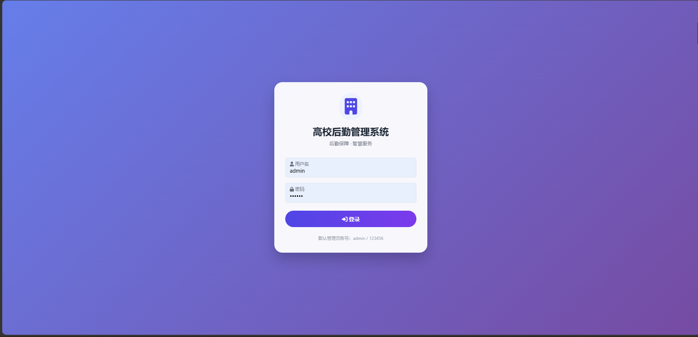
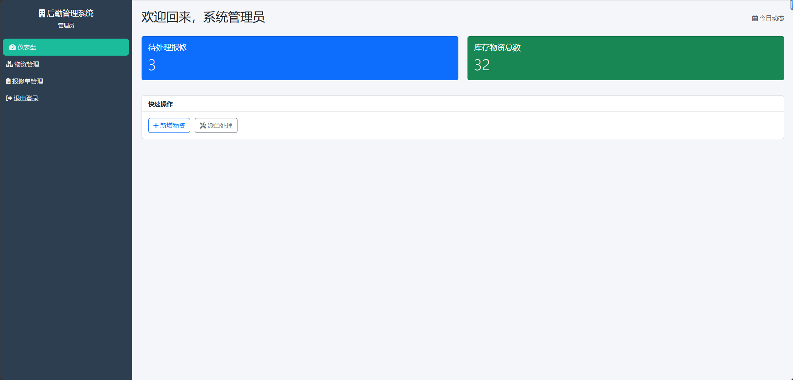
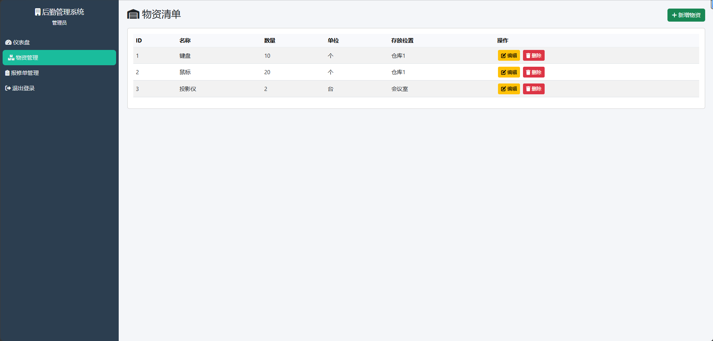
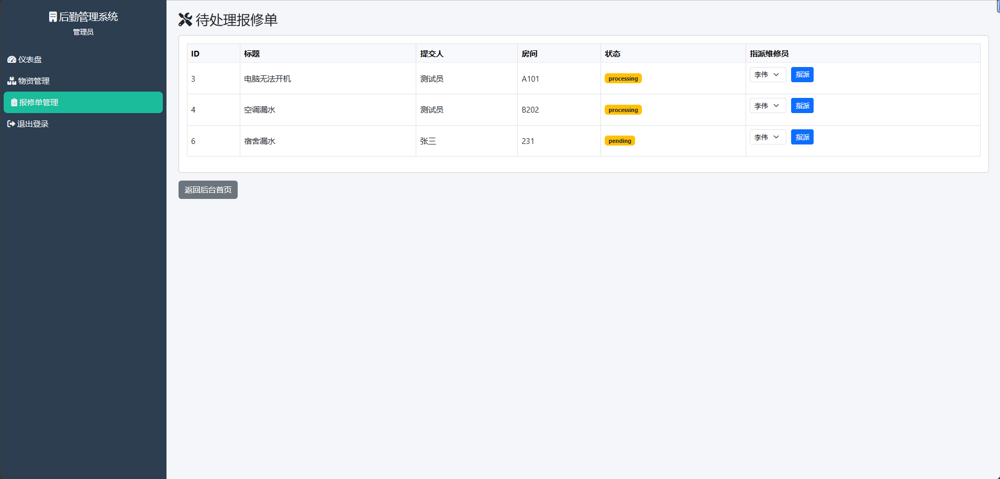
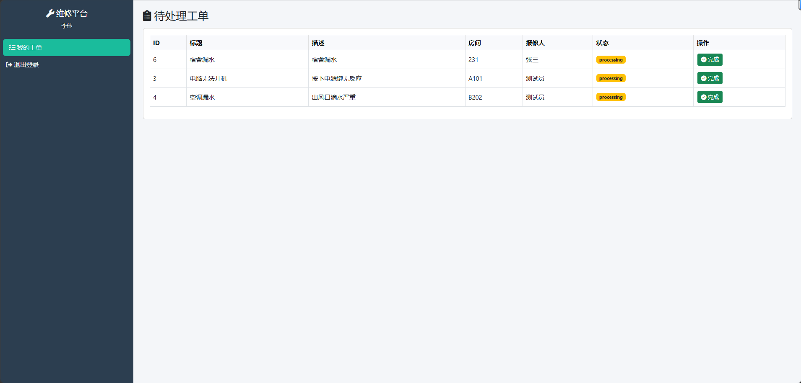
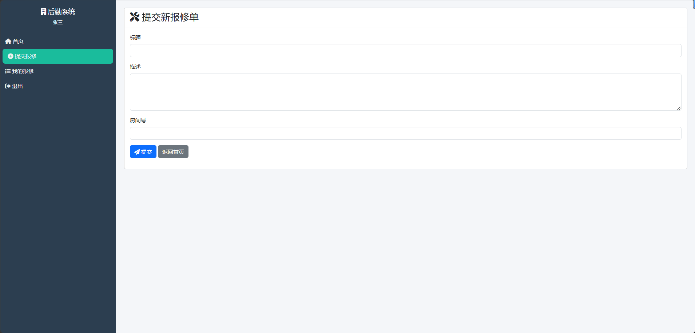
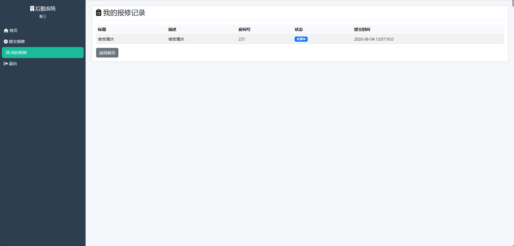

# 高校后勤管理系统

基于 JavaWeb 的后勤报修与物资管理平台，采用 MVC 架构、RBAC 权限控制、HikariCP 连接池。

## 技术栈
- **后端**：Java 8/17、Servlet、JSP、JSTL、HikariCP
- **数据库**：MySQL 8
- **前端**：Bootstrap 5、Font Awesome、HTML/CSS/JS
- **开发工具**：IntelliJ IDEA、Tomcat 9、Maven、Git

## 主要功能

### 角色与权限（RBAC）
- 三种角色：**管理员**、**维修员**、**普通用户**
- 基于角色的权限控制，不同角色访问不同页面

### 报修工单模块
- **普通用户**：提交报修单，查看自己的报修记录
- **管理员**：查看所有待处理报修单，指派给维修员
- **维修员**：查看指派给自己的工单，点击“完成”更新状态
- 状态流转：pending（待处理）→ processing（处理中）→ completed（已完成）

### 物资管理模块
- 管理员对物资进行增删改查
- 支持物资名称、数量、单位、存放位置等字段

### 仪表盘
- 实时统计待处理报修单数量、物资库存总数（从数据库查询）

## 数据库设计
共 7 张表：
- `user`：用户信息
- `role`：角色（admin/repairer/user）
- `permission`：权限（预留）
- `role_permission`：角色权限关联（预留）
- `repair_order`：报修工单
- `material`：物资
- `operation_log`：操作日志（预留）

## 本地运行步骤
1. 安装 MySQL 8，执行 `logistics_db.sql` 创建数据库及表（项目根目录下应包含该 SQL 文件）。
2. 修改 `src/main/java/com/logistics/util/DBUtil.java` 中的数据库用户名和密码。
3. 使用 IntelliJ IDEA 打开项目，配置 Tomcat 9，部署 `war` 包。
4. 启动 Tomcat，访问 `http://localhost:8080/logistics`。
5. 测试账号：
   - 管理员：`admin` / `123456`
   - 维修员：`liwei` / `123456`
   - 普通用户：`zhangsan` / `123456`

## 项目截图

### 登录页

### 管理员仪表盘

### 物资管理列表

### 报修单管理（管理员）

### 维修员工作台

### 普通用户提交报修

### 普通用户报修记录

## GitHub 仓库
[点击查看源码](https://github.com/Jianxixiaber/LogisticsManagement)

## 作者
lianaxiuber

## 许可证
MIT

